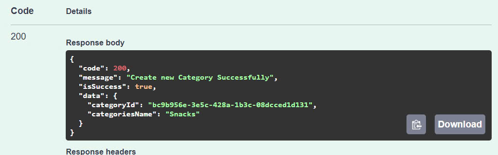
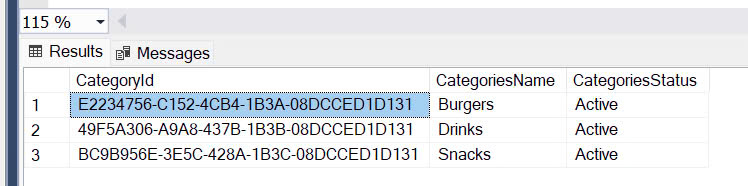
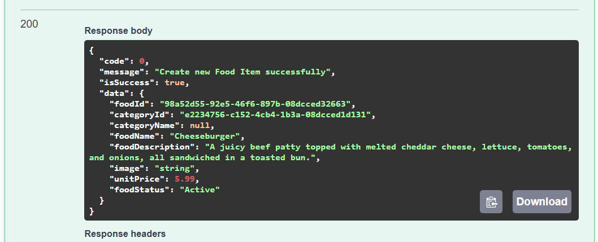
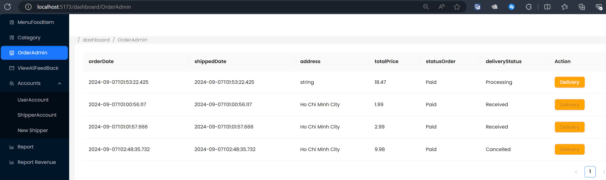
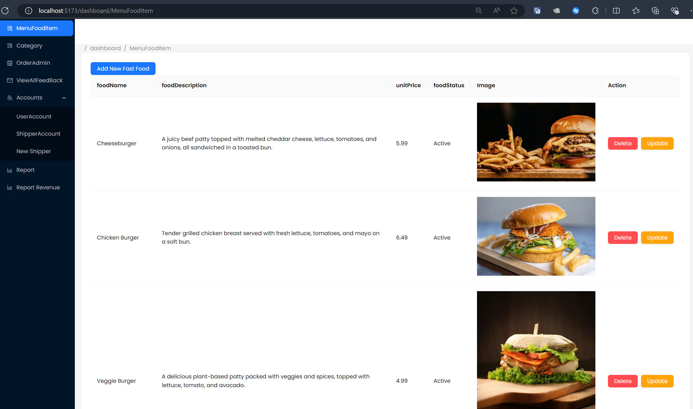
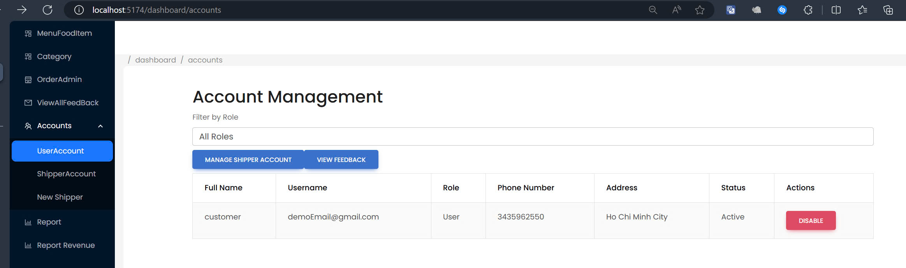
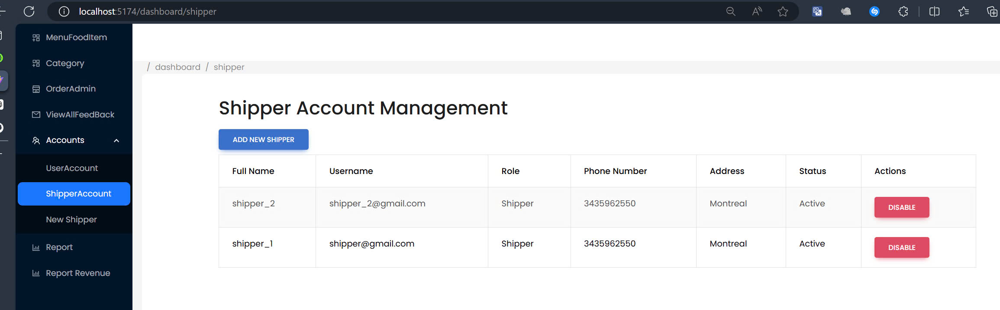
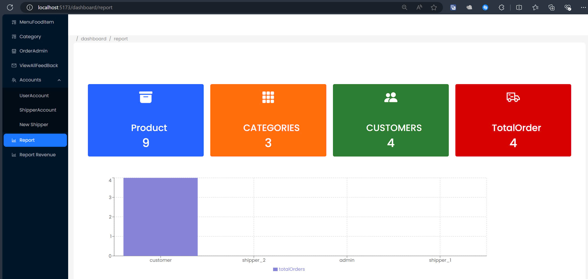
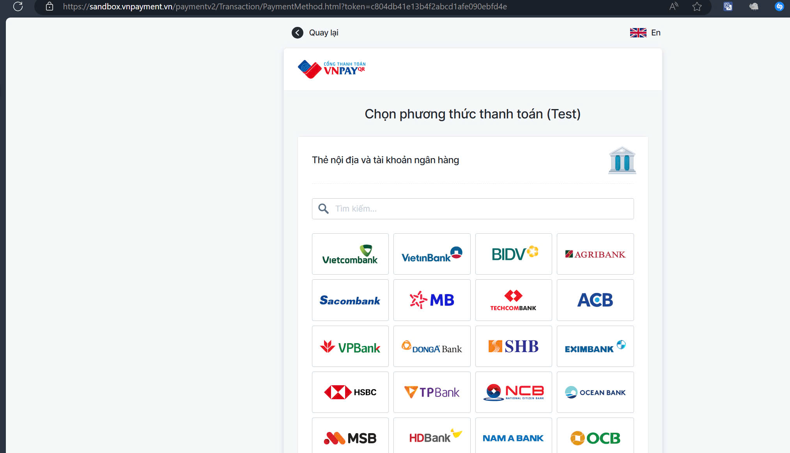
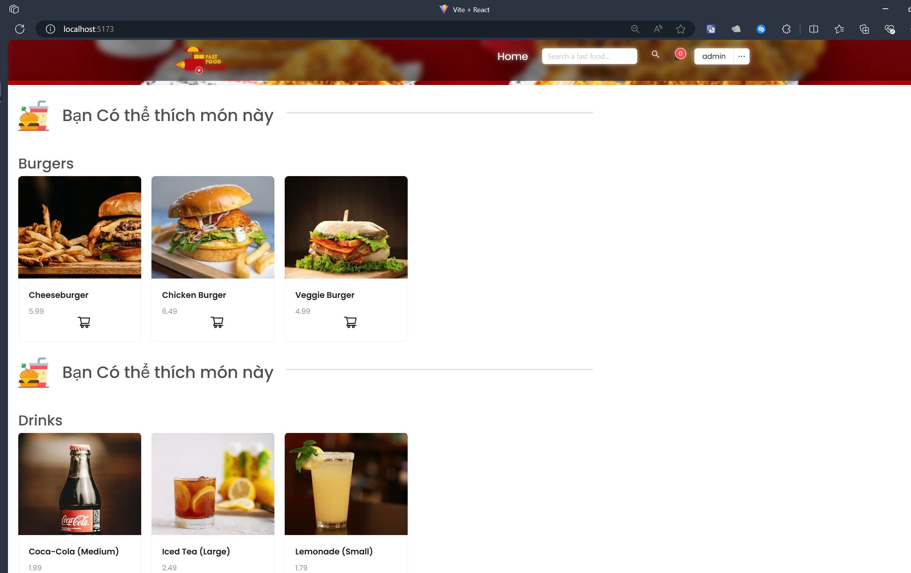

# Fast Food Delivery App 

## Overview
This README document outlines the steps necessary to install and run the Fast Food Delivery App. It includes instructions for setting up the database, running the application, inserting sample data, and creating user roles.

## Prerequisites
- SQL Server 2022
- Visual Studio 2022
- Node.js installed (for running the front-end)

## Setup Instructions

### Database Configuration
1. Open the solution in Visual Studio and locate the `appsettings.json` file.
2. Modify the `server`, `uid`, and `pwd` fields to reflect your SQL Server credentials.

### Database Initialization
1. Navigate to `Tools > NuGet Package Manager > Package Manager Console`.
2. In the Default Project dropdown, select the Business Layer.
3. Run `update-database` to create the `fastfooddeliverydb_prn231` database in SQL Server.

### Front-End Setup
1. For front-end developers, run the program and navigate to [https://localhost:7173/swagger/index.html](https://localhost:7173/swagger/index.html) to view the Swagger UI with all API links.
2. To run the React application, navigate to the main React folder (add specific folder path here) and open a command prompt at this location.
3. Run `npm run dev`. Ensure the application is running on localhost successfully; a default browser will automatically open.

### Account Registration and Use
1. Register a customer account to start ordering. Navigate through the Swagger UI to insert sample data.
2. Follow the documented steps to create food items and categories, and register as a customer:

   1. Create several categories (contains food items), click Execute if the response body code 200 means creation was successful.
   
   2. Display data in dbo.Category to get CategoryId which has been automatically generated, so we can continue creating food items.
   
   3. Create a food item within a category as shown in the picture; if going well, the response body code 200.
   

### Sample Data Insertion
1. Create several categories and execute the creation. Check the response body for a code 200 to confirm successful creation.
2. Display data in `dbo.Category` to retrieve the `CategoryId`. Use this ID to create food items.

### Admin and Shipper Creation
- **Admin Account:**
  1. Register as a customer.
  2. Query `dbo.AspNetRoles` for the Admin role ID.
  3. Overwrite the Admin role ID into `dbo.AspNetUserRoles` for the user account created in step 1.

- **Shipper Account:**
  1. Log in as an Admin.
  2. Navigate to the Shipper Account Management section to add a new shipper.

### Application User Interface
Here are some views of the application's user interface:
- **Admin Dashboard:**
  
  
  
  
  
  

- **Customer Payment UI:**
  

- **Homepage View:**
  

### Order Processing Flows
- **Case 1:** When an order's status is Paid and the DeliveryStatus is Processing, the admin can assign a shipper. Once assigned and confirmed by the shipper, the DeliveryStatus changes to Delivered.
- **Case 2:** If a shipper rejects the order, the status changes to Cancelled.

### Important Notices
- Ensure the SQL Server connection details are correct.
- Keep the command prompt running while using the application.
- Set your desktop's date and time to UTC+7 (Bangkok, Hanoi, Jakarta) to match the application's timezone settings.

## Tools Used
- SQL Server 2022
- Visual Studio Code 2022
